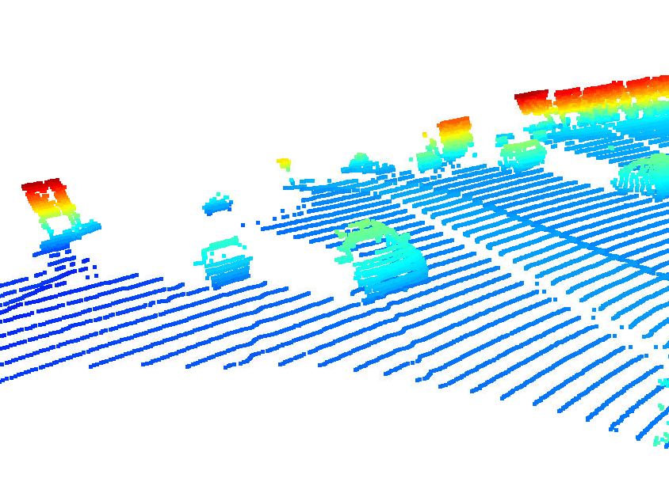

# Writeup: 3D Object dtection

In this project, a deep-learning approach is used to detect vehicles in LiDAR data based on a birds-eye view perspective of the 3D point-cloud. Also, a series of performance measures is used to evaluate the performance of the detection approach.

## Section 1 : Compute Lidar Point-Cloud from Range Image

### Visualize range image channels

In the Waymo Open dataset, lidar data is stored as a range image. Therefore, this task is about extracting two of the data channels within the range image, which are "range" and "intensity", and convert the floating-point data to an 8-bit integer value range.

Results of range image.

### Visualize lidar point-cloud

The goal of this task is to use the Open3D library to display the lidar point-cloud in a 3d viewer in order to develop a feel for the nature of lidar point-clouds.

In this image you can see the point-cloud is able to display this truck with a trailer.

The point-cloud was able to display this compact car. We can see it is a 2-door car showing full front and side view. The hood, windshield, and tires can be seen.

Here in the point-cloud, we can see a SUV on the left and a 4-door car on the right. The point-cloud is able to display the windshield and front-end of the SUV.

In this image, we can see the point-cloud is displaying vehicles waiting for their right-of-away. The first vechile is a small compact car, and the point-cloud is able to display the tires, front-end and windshield. The second vehicle is cut-off, but we can a larger vehicle behind it. We can see the tires, bumper and windshield of the third vehicle. 

In this image we can identify the vehicles on the left are parked and the vehicles on the right are waiting for their right-of-way. The first vehicle parked, we can identify the side mirrors, windshield, and bumper.

In this image, the point-cloud is able to display the vehicle are center very clear with the tires, side mirrors, side view and back. 

In this image, the point-cloud is able to display a full compact vehicle with many points, almost if a smoothing filter was applied to the point-cloud. The vehicle behind we can identify the side mirrors, bumper and headlights. 

In this image, we can see the point-cloud is displaying the side view of the truck. We can identify the tires, side mirrors and windshields. 

In this image, the point-cloud is able to display the front-end of the vehicle showing the side-mirrors, bumper and headlights.

In this image, we can see the point-cloud is displaying the side view of this vehicle an we can identify the side mirrors, tires and rear bumper.

## Section 2 : Create Birds-Eye View from Lidar PCL

### Convert sensor coordinates to BEV-map coordinates

The goal of this task is to perform the first step in creating a birds-eye view (BEV) perspective of the lidar point-cloud

Result Image

### Compute intensity layer of the BEV map

The goal of this task is to fill the "intensity" channel of the BEV map with data from the point-cloud. In order to do so, you will need to identify all points with the same (x,y)-coordinates within the BEV map and then assign the intensity value of the top-most lidar point to the respective BEV pixel

Result Image

### Compute height layer of the BEV map

The goal of this task is to fill the "height" channel of the BEV map with data from the point-cloud.

Result Image

## Section 3 : Model-based Object Detection in BEV Image

### Add a second model from a GitHub repo

The goal of this task is to illustrate how a new model can be integrated into an existing framework. 

### Extract 3D bounding boxes from model response

As the model input is a three-channel BEV map, the detected objects will be returned with coordinates and properties in the BEV coordinate space. Thus, before the detections can move along in the processing pipeline, they need to be converted into metric coordinates in vehicle space. This task is about performing this conversion such that all detections have the format [1, x, y, z, h, w, l, yaw], where 1 denotes the class id for the object type vehicle

Result Image

## Section 4 : Performance Evaluation for Object Detection

### Compute intersection-over-union between labels and detections

The goal of this task is to find pairings between ground-truth labels and detections, so that we can determine wether an object has been (a) missed (false negative), (b) successfully detected (true positive) or (c) has been falsely reported (false positive).

### Compute false-negatives and false-positives

Based on the pairings between ground-truth labels and detected objects, the goal of this task is to determine the number of false positives and false negatives for the current frame.

### Compute precision and recall

After processing all the frames of a sequence, the performance of the object detection algorithm shall now be evaluated.

Result Image 

