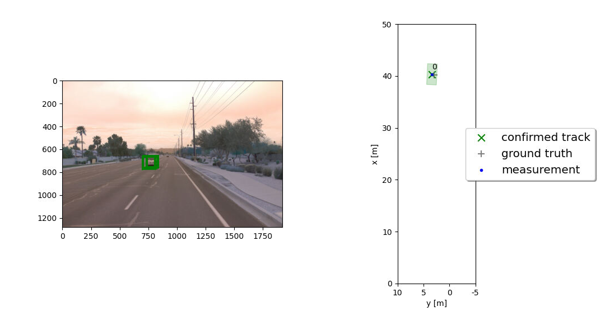
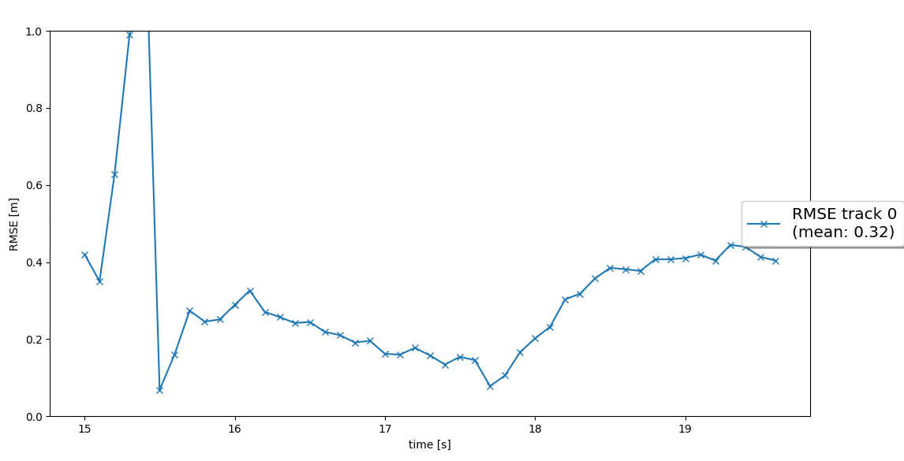
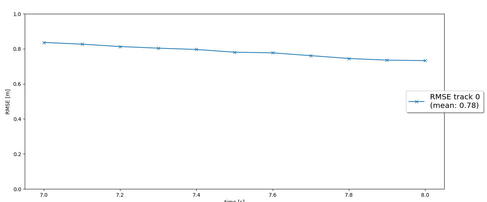
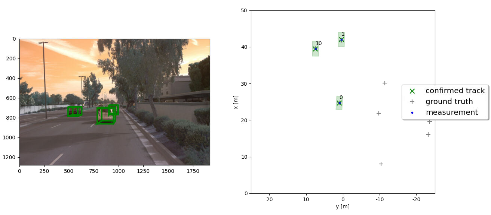
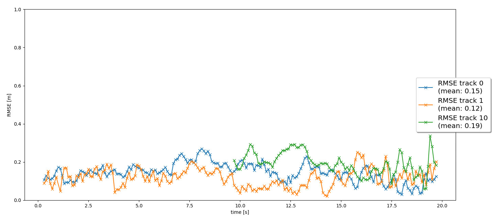
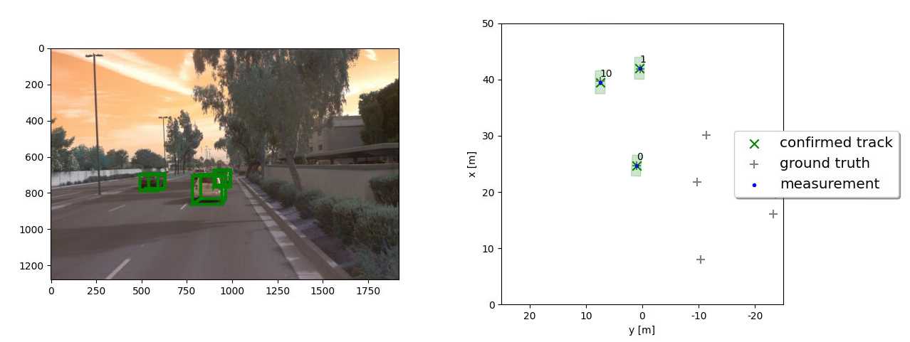

# Writeup: Track 3D-Objects Over Time

Please use this starter template to answer the following questions:

### 1. Write a short recap of the four tracking steps and what you implemented there (filter, track management, association, camera fusion). Which results did you achieve? Which part of the project was most difficult for you to complete, and why?

## Step 1: Extended Kalman Filter

In the first step, an Extended Kalman Filter (EKF) is implemented to estimate the states of a single target using lidar measurements. The system state is a 6 dimensional that consist of [x ,y, z, vx, vy, vz] and with constant velocity. Similar to the traditional Kalman Filter, the EKF also uses the measurement update and predicted steps. To linearlize the system, the Jacobian was taken for the measurement model of the camera.

The Root Mean Square Error (RMSE) is used to validate the tracking performance of the EKF. See results.

## Step 2: Track Management

In the second step, a track management is implemented to initialize and delete tracks, set a track state and score. The track is first initialized with unassigned lidar calculation. The tracks get deleted if the score is too low or high. Achieving a RMSE of 0.78. 

## Step 3: Data Association

In the third step, an implementation of a single nearest neighbor data association to associate measurements tracks. The nearest neighbor data association matches measurements to the tracks and decides whether to update with measurement using Mahalanobis Distance (MHD). The MHD is able to measure the distance between a point and distribution. See Results.

## Step 4: Camera Sensor Fusion

In the fourth step, a nonlinear camera measurement model is implemented to perform multi-target tracking by fusing lidar and camera measurements. Coordinates from both lidar and camera are transformed into vehicle coordinates by using a homogeneous transformation matrix.

The part that I hard the most trouble was with implementing the camera measurement model because it was not as guided as the other topics (EKF, track management, and data association). I was not sure if I was implementing the camera measurement model correctly. After carefully reviewing the lectures and hints I was able to get implement the carema measurement model.

### 2. Do you see any benefits in camera-lidar fusion compared to lidar-only tracking (in theory and in your concrete results)?

Yes, there is benefits from using camera-lidar fusion because cameras are able to produce high resolution 2D images and provide well define dimensions of objects. Lidar is an optical sensor that provides distance measurements from objects depending on how the light reflects back from the sensor. Having a camera fused with a lidar sensor can help with providing more information about meauserements that the lidar sensor failed to do.

### 3. Which challenges will a sensor fusion system face in real-life scenarios? Did you see any of these challenges in the project?

In real-life scenarios cameras experience a lot of variation with depending on the light conditions. At night, images tend to be less accurate since it can be diffucul to detect objects. During day light, at times images can be too saturated due to being too bright.

### 4. Can you think of ways to improve your tracking results in the future?

- Use a bicycle model to represent the system.
- Use different pretrained neural networks to compare tracking performance. 

